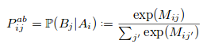
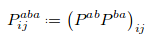
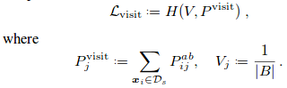

# Associative Domain Adaptation

**Problem**

Domain adaptation - task of inferring class labels for an unlabeled target domain based on statistical properties of a labeled source domain.

**Key points**

1. Authors introduce a new similarity loss for enforcing associations between same classes of source and target domains, as opposed to **M**aximum **M**ean **D**iscrepancy that is not class specific.
2. Formalize the transition probability from one embedding to the another (source to target domain) by

    

    where *Mij* is the dot product of *Ai* and *Bj*. Associative similarity is then formalized as a two-step round trip probability:

    

3. Net association loss is a weighted summation of a *walker loss* and a *visit loss* :
    * *Walker loss* is a cross-entropy loss which forces the two-step probabilities to be similar to the uniform distribution of class labels:

        

    * *Visit loss* is used as a regularizer to ensure that each target sample is visited with equal probability. It's a cross entropy loss between uniform distribution of target samples and probability of visiting some target sample from any source sample:

         

4. This association loss could then be used with any other network for domain adaptation.
5. While training, authors ensure that mini-batches have examples from all classes.
6. Network is initially optimized on classification loss only and the weight for association loss is gradually increased.

**Results**

1. Show state-of-the-art results on various small datasets.
2. Show that reducing association loss also reduces the MMD, but lower MMD does not imply lower test errors. The relation holds true for the proposed loss though.
3. t-SNE embeddings show that class clustering is better using this technique.

**Notes**

1. A plug-and-play non-trivial technique that can be used effectively on various classification tasks.
2. Can the approach be generalized to non-classification tasks?
3. Should report results on more complex datasets.
