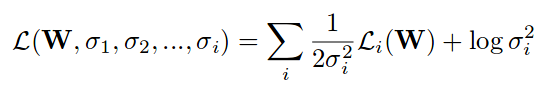
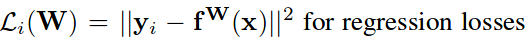
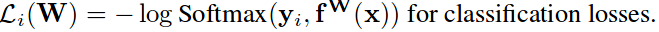

# Multi-Task Learning Using Uncertainty to Weigh Losses for Scene Geometry and Semantics

**Problem**

How to weigh multiple losses when doing multi-task deep learning

**Key points**

1. Introduce the concept of *Homoscedastic Uncertainty* - a task dependent uncertainty that's not dependent on input data and is not a model output, for measuring the uncertainty of each vision task.
2. Formulate the total loss of multiple tasks as:

where:

3. `log(sigma*sigma)` empirically found to converge within 100 iterations when initialized from -2 to 5.

**Results**

1. Better results on all tasks when optimized with other tasks as compared to single task learning. The three tasks chosen were single image depth prediction, semantic segmentation and instance level segmentation.

**Notes**

1. Nice way to model task weights that can be learned by backpropagation.
2. More experiments should have been conducted with different tasks and ablations.
3. Doesn't talk about how the choice of architecture affects the results and task weights.