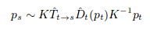

# Unsupervised Learning of Depth and Ego-Motion from Video

**Problem**

Ego-motion prediction from videos and depth estimation from single images. 

**Key points**

1. Authors propose an end-to-end learning framework that estimates monocular depth and camera motion from video sequences that uses view synthesis as the supervisory signal.
2. The view synthesis loss is formulated as an L1 loss between target image and warped sourge images (authors use 2 source views and 1 target view).
3. Use bilinear interpolation to differentiably render the target view using predicted transformation parameters, camera intrinsics, source image and predicted depth maps. 
    
4. Model the inconsistencies and occlusions between different views through a pixel-level explainability mask which weighs the pixel depending on the objects. To avaoid a trivial zero solution, a regularization term is added to encourage non-zero values in the mask.
5. Disparity smoothness is enforced by penalizing less on texture-less regions and more on sharp regions.
6. Depth maps generated are not to scale, so they scale w.r.t the median of ground truth.

**Results**

1. Show comparable results on KITTI dataset for depth estimation.
2. Explainability mask only results in small improvements.

**Notes**

1. Claim that depth prediction is totally unsupervised but in fact use multiple view supervision for training, even though captured at different time.
2. Predictions are not at scale and median from ground truth is used for scaling the predictions. It's unclear how the network works at test time.
3. Depends on camera intrinsics and hence is not easily generalizable.